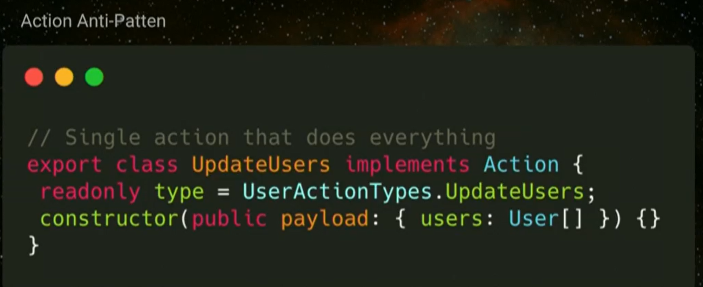

# Best Practices and Pitfalls\(Verbose\)

## Store

### What to put in the store?

Use SHARI principle. Start from a reasonable standpoint that nothing should be in the store unless it proves itself to be in the store. Rather than to put everything in the store and pull it out once it becomes it problematic

> The NgRx core team has come up with a principle called **SHARI**, that can be used as a rule of thumb on data that needs to be added to the store.
>
> *  **Shared**: State that is shared between many components and services
> *  **Hydrated**: State that needs to be persisted and hydrated across page reloads
> *  **Available**: State that needs to be available when re-entering routes
> *  **Retrieved**: State that needs to be retrieved with a side effect, e.g. an HTTP request
> *  **Impacted**: State that is impacted by other components

Redux provides the following rules of thumb to determine what kind of data should be in the store  
[https://redux.js.org/faq/organizing-state\#do-i-have-to-put-all-my-state-into-redux-should-i-ever-use-reacts-setstate](https://redux.js.org/faq/organizing-state#do-i-have-to-put-all-my-state-into-redux-should-i-ever-use-reacts-setstate)

> * Do other parts of the application care about this data?
> * Do you need to be able to create further derived data based on this original data?
> * Is the same data being used to drive multiple components?
> * Is there value to you in being able to restore this state to a given point in time \(ie, time travel debugging\)?
> * Do you want to cache the data \(ie, use what's in state if it's already there instead of re-requesting it\)?
> * Do you want to keep this data consistent while hot-reloading UI components \(which may lose their internal state when swapped\)?


### Do not put model objects/view models into the store

#### Why? 

it can be reused by multiple components and view models should be constructed using selectors

### Recommended to use atomic state 

### Container/Presenters

### Services with a subject

### Avoid state Duplication

#### Direct Entity Duplication


In the code above the state is duplicated in the selected client, instead of using this, you can save the identifier  


#### Avoid Implicit State Duplication

Prefer the use of selectors instead of duplicating state. 

The following is an example of how the state is duplicated by saving the total number of clients

```typescript
interface State {
    clients: {[key:number]: Client};
    totalClients: number;
}
```


### Avoid Franken State

{{TBD}}


### Avoid related/Nested data

Avoid related nested data to not complicate reducer and keep the store easy to mutate.

### Prefer dictionaries versus arrays \(NgRx Entity\)

Prefer the use of dictionaries \(NgRx Entity\) when having  a collection of data because it is more efficient.

### Use service with a subject \(component-store\)

Prefer the use of a service with a subject or  NgRx component store when the state doesn't satisfies the S.H.A.R.I. principle or is state that is only needed for a presentational component.

When NOT to use Service with a Subject?

* Application or feature is complex
* Want to track state changes
* Recreate user errors
* Implement advanced logging

## Actions

### Create actions based on events not commands

Actions are events not commands

Do not dispatch actions as if they were commands like "Save Result" or "Open Modal".  Instead think about it as what buttons the user clicked, what text did they enter, what flow did they began.

Actions should be unique, a user clicking a certain button vs a similar button in a different view are unique events. They are similar in what they will trigger but they are unique in the context where they occur.

_It is cheap to make actions_


#### If one event occurs it should be linked to one action


If somebody submits a form to put some to-do sent they might dispatch actions to:

1\) Post the to-do  
 2\) Open a toast  
 3\) Go to the dashboard  


```typescript
function submitFormCommands({todo}){
  this.store.dispatch(postTodo());
  this.store.dispatch(openToast('Form Submitted));
  this.store.dispatch(navigateTo('Dashboard));
}
```

This will require to have effects that post the to do, that open the toast and that navigate to the dashboard.

This is making some of your code and your actions much harder to understand and your flows much harder to understand because if you ever arrive at the open toast action it is harder to find how many different places is this used? where is it dispatched from? what if I want to change what happens when a toast is opened?

Eg. to have another step that has happened before, is it ok to have it every single place that I'm showing a toast to have that occur.

When you make your actions super super super specific \(and using commands\) you lose that functional programming/declarative style and the ability to change and adapt. This is changing it to an imperative mode since it is specified exactly what needs to happen and removes all that flexibility.

Again you go back to having things which are tightly coupled but they're tightly coupled through the indirection of NgRx which is the worst of both worlds.

Instead, this should dispatch a single action and all the different steps should be handle in the effect.

```typescript
function submitFormCommands({todo}){
    this.store.dispatch(todoSubmitted());
}
```

### Use Event Storming as a tool to figure it out the events and actions

This helps to think in terms of events and not in terms of things that you want to happens as a response when an event happens. This also helps the team to get better at using NgRx, because this is done as a group exercise. This can help to have one developer buld UI and selectors while  other builds the effect and reducers.

You can use sticky notes as a group to identify:

* All of the events in the system
* The commands that cause the event to arise
* The actor in the system that invokes the command
* The data models attached to each event

Example


### Write actions before developing features to understand and gain a shared knowledge of the feature being implemented.

### Do not shortcuts when creating actions, avoid creating actions that modify multiple parts of the state

Do not have a an action like `modify order` that modifies any deatils of the order. Doing this removes traceability



### 3 action approach - request, success, failure

### Naming - Categorize actions based on the event source.


### Naming - Capture _events_ **not** _commands_ as you are separating the description of an event and the handling of that event.

### Naming - Name _format_

* The **category** of the action is captured within the square brackets `[]`
* It is recommended to use present or past tense to **describe the event occurred** and stick with it.

_**Example**_

* When related to components you can use present tense because they are related to events. It is like in HTML the events do not use past tense. Eg. `OnClick` or `click` is not `OnClicked` or `clicked`

```typescript
  export const createBook = createAction(
      '[Books Page] Create a book',
      props<{book: BookRequiredProps}>()
  );

  export const selectBook = createAction(
      '[Books Page] Select a book',
      props<{bookId: string}>()
  );
```

* When the actions are related to API you can use past tense because they are used to describe an action that happened

```typescript
export const bookUpdated = createAction(
    '[Books API] Book Updated Success',
    props<{book: BookModel}>()
);

export const bookDeleted = createAction(
   '[Books API] Book Deleted Success',
   props<{bookId: string}>()
);

```

### FOLDER STRUCTURE - Separate actions by event source

The actors can be either the container or a service. 

### FOLDER STRUCTURE - Use an action file for the feature whenever event does not belong to containers nor services

### FOLDER STRUCTURE - Use barrel file to export action with a more relatable name

It is a good practice to have the actions define close to the feature that uses them.

```text
├─ books\
│     actions\
│         books-api.actions.ts
│         books-page.actions.ts
│         index.ts      
```

The index file can be used to define the names for the actions exported, but it can be completely avoided

```typescript
import * as BooksPageActions from "./books-page.actions";
import * as BooksApiActions from "./books-api.actions";

export { BooksPageActions, BooksApiActions };
```

## Reducers


## Selectors

### Maximize Selectors


### Use selector to map/transform data

#### Why?

To keep the store state in a usable format for multiple selectors and components.

### Prefer to initialize Selectors in the constructor

When using the selector in the component, it is recommended not initialize them in the declaration and instead declared in the constructor

```typescript
export class FindBookPageComponent {
  searchQuery$: Observable<string>;
  books$: Observable<Book[]>;
  loading$: Observable<boolean>;
  error$: Observable<string>;

  constructor(private store: Store<fromBooks.State>) {
    this.searchQuery$ = store.pipe(
      select(fromBooks.selectSearchQuery),
      take(1)
    );
    this.books$ = store.pipe(select(fromBooks.selectSearchResults));
    this.loading$ = store.pipe(select(fromBooks.selectSearchLoading));
    this.error$ = store.pipe(select(fromBooks.selectSearchError));
  }

  search(query: string) {
    this.store.dispatch(FindBookPageActions.searchBooks({ query }));
  }
}
```

If using the strict mode in TypeScript, the compiler will not be able to know that the selectors were initialized on `ngOnInit`

## Effects

### Avoid effect dominoes

### Stateless Effects


## NgRx Entity


## Component-store


